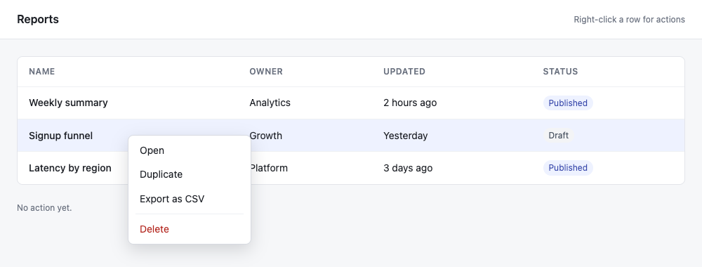

# Getting Started

Motus is a browser automation and testing framework for .NET that communicates directly with browsers over CDP and WebDriver BiDi, with no Node.js sidecar required. This guide walks through installation, writing your first test, and running it.

## Prerequisites

- .NET 8.0 SDK or later
- A test framework of your choice (MSTest, NUnit, or xUnit)

## Installation

Add the Motus core package and the integration for your test framework:

```bash
# Core package (always required)
dotnet add package Motus

# Pick one test framework integration
dotnet add package Motus.Testing.MSTest
dotnet add package Motus.Testing.NUnit
dotnet add package Motus.Testing.xUnit
```

Install the CLI tool and download a browser:

```bash
dotnet tool install --global Motus.Cli
motus install
```

`motus install` downloads Chromium by default. To install a different browser:

```bash
motus install --channel firefox
motus install --channel chrome
motus install --channel edge
```

Optionally, add the Roslyn analyzers to catch common mistakes at compile time:

```bash
dotnet add package Motus.Analyzers
```

## Your First Test

### MSTest

MSTest uses a shared browser across the assembly with one isolated context per test.

```csharp
// AssemblySetup.cs
using Motus.Abstractions;
using Motus.Testing.MSTest;

[TestClass]
public class AssemblySetup
{
    [AssemblyInitialize]
    public static async Task Initialize(TestContext _) =>
        await MotusTestBase.LaunchBrowserAsync(new LaunchOptions { Headless = true });

    [AssemblyCleanup]
    public static async Task Cleanup() =>
        await MotusTestBase.CloseBrowserAsync();
}
```

```csharp
// SearchTests.cs
using Motus.Testing.MSTest;
using static Motus.Assertions.Expect;

[TestClass]
public class SearchTests : MotusTestBase
{
    [TestMethod]
    public async Task PageHasTitle()
    {
        await Page.GotoAsync("https://example.com");

        await That(Page).ToHaveTitleAsync("Example Domain");
    }

    [TestMethod]
    public async Task ClickLink()
    {
        await Page.GotoAsync("https://example.com");

        await Page.GetByRole("link", "More information...").ClickAsync();

        await That(Page).ToHaveUrlAsync("*iana.org*");
    }
}
```

### NUnit

NUnit launches a browser per fixture and creates one context per test. No assembly-level setup is needed.

```csharp
using Motus.Testing.NUnit;
using static Motus.Assertions.Expect;

[TestFixture]
public class SearchTests : MotusTestBase
{
    [Test]
    public async Task PageHasTitle()
    {
        await Page.GotoAsync("https://example.com");

        await That(Page).ToHaveTitleAsync("Example Domain");
    }
}
```

### xUnit

xUnit uses a collection fixture for the shared browser and a class fixture for per-test context.

```csharp
using Motus.Testing.xUnit;
using static Motus.Assertions.Expect;

[Collection(nameof(MotusCollection))]
public class SearchTests : IClassFixture<BrowserContextFixture>
{
    private readonly BrowserContextFixture _fixture;

    public SearchTests(BrowserContextFixture fixture) => _fixture = fixture;

    [Fact]
    public async Task PageHasTitle()
    {
        await _fixture.Page.GotoAsync("https://example.com");

        await That(_fixture.Page).ToHaveTitleAsync("Example Domain");
    }
}
```

## Running Tests

Run tests with the standard `dotnet test` command:

```bash
dotnet test
```

Or use the Motus CLI for richer output and reporting:

```bash
motus run bin/Release/net8.0/MyTests.dll --reporter console
```

Add `--visual` to open the Blazor-based visual runner:

```bash
motus run bin/Release/net8.0/MyTests.dll --visual
```

### Headed Mode

By default Motus runs headless. To see the browser while developing tests, set `Headless = false` in your launch options or use an environment variable:

```bash
MOTUS_HEADLESS=false dotnet test
```

### Slow Motion

Slow down every operation to watch what the test is doing:

```bash
MOTUS_SLOWMO=500 dotnet test
```

## Core Concepts

### Locators

Locators are the primary way to find elements on a page. They auto-wait for elements to be actionable before performing operations.

```csharp
// CSS selector
Page.Locator("button.submit")

// Semantic selectors (preferred)
Page.GetByRole("button", "Submit")
Page.GetByText("Welcome")
Page.GetByLabel("Email address")
Page.GetByPlaceholder("Search...")
Page.GetByTestId("login-form")
```

Locators can be chained and filtered:

```csharp
Page.GetByRole("listitem")
    .Filter(new LocatorOptions { HasText = "Product A" })
    .GetByRole("button", "Add to cart")
    .ClickAsync();
```

### Actions

Common interactions on locators:

```csharp
await locator.ClickAsync();
await locator.FillAsync("hello@example.com");
await locator.SelectOptionAsync("medium");
await locator.CheckAsync();
await locator.PressAsync("Enter");
```

A click can name a mouse button or hold modifier keys by passing `MouseButtonOptions`. It runs the same actionability checks as a plain click, so the element still has to be visible, enabled, settled, and receiving events before the button goes down. Assembling the same click from a bounding box and `Page.Mouse` skips every one of those checks, which is why a right-click or a modified click belongs on the locator. Double-clicking stays left-button only.

```csharp
// Right-click, then pick from the menu the page draws for itself
await Page.Locator("tr.report").ClickAsync(new MouseButtonOptions(MouseButton.Right));
await Page.GetByRole("menuitem", "Export as CSV").ClickAsync();

// Middle-click, and a click with Control held
await link.ClickAsync(new MouseButtonOptions(MouseButton.Middle));
await link.ClickAsync(new MouseButtonOptions(Modifiers: KeyModifier.Control));

// Modifiers combine
await cell.ClickAsync(new MouseButtonOptions(Modifiers: KeyModifier.Control | KeyModifier.Shift));
```



The menu above is the page's own, drawn in HTML because the page handled the `contextmenu` event itself. That is the kind of menu a test can read and click. A browser's native context menu is drawn outside the page, so it neither appears in a screenshot nor answers to a locator.

#### Per-call timeouts

Most actions take a timeout in milliseconds as their last argument, which overrides the default for that one call:

```csharp
await locator.ClickAsync(timeout: 2000);
await locator.ClickAsync(new MouseButtonOptions(MouseButton.Right), timeout: 2000);
```

Typing and pressing carry theirs in their options record, alongside the key delay:

```csharp
await locator.TypeAsync("hello", new KeyboardTypeOptions(Delay: 50, Timeout: 2000));
await locator.PressAsync("Enter", new KeyboardPressOptions(Timeout: 2000));
```

Selecting an option takes one through an overload that accepts the values as an array. The timeout there has no default, so passing values on their own still means what it always did:

```csharp
await locator.SelectOptionAsync(["large"], timeout: 2000);
```

### Assertions

Assertions re-evaluate until they pass or a timeout is reached, so there is no need to wait for a value the page has not settled on yet. A locator assertion still needs its element to be present: it fails at once when the locator matches nothing, so wait for an element that has still to render with `ToBeAttachedAsync` first. Use `Expect.That()` or import it statically:

```csharp
using static Motus.Assertions.Expect;

// Page assertions
await That(Page).ToHaveTitleAsync("Dashboard");
await That(Page).ToHaveUrlAsync("**/dashboard");

// Locator assertions
await That(Page.GetByRole("heading")).ToHaveTextAsync("Welcome");
await That(Page.GetByRole("button", "Submit")).ToBeEnabledAsync();

// Negation
await That(Page.Locator(".spinner")).Not.ToBeVisibleAsync();
```

### Navigation

```csharp
await Page.GotoAsync("https://example.com");
await Page.GoBackAsync();
await Page.GoForwardAsync();
await Page.ReloadAsync();

// Wait for a specific URL after an action triggers navigation
await Page.WaitForURLAsync("**/dashboard");
```

A tab the page opens for itself, through `window.open` or a link with `target="_blank"`, is a page like any other: it joins the context's pages and the page that opened it raises `Popup` with the new `IPage`. Subscribe before the click that opens it, since the tab can arrive before the click returns. The new tab is often still on `about:blank` when it is handed over, so wait on it rather than reading its URL straight away.

```csharp
var opened = new TaskCompletionSource<IPage>(TaskCreationOptions.RunContinuationsAsynchronously);
Page.Popup += (_, popup) => opened.TrySetResult(popup);

await Page.GetByRole("link", "Open report").ClickAsync();

IPage report = await opened.Task;
await report.WaitForLoadStateAsync();
```

See [Browser Lifecycle](architecture/browser-lifecycle.md#popups-and-new-tabs) for how those tabs are tracked.

## Configuration

Motus supports a layered configuration model: `motus.config.json` < environment variables < code. Create a `motus.config.json` in your project root for shared defaults:

```json
{
  "launch": {
    "headless": true,
    "channel": "chromium",
    "timeout": 30000
  },
  "assertions": {
    "timeout": 5000
  },
  "failure": {
    "screenshot": true,
    "screenshotPath": "test-results/screenshots"
  }
}
```

Environment variables use the `MOTUS_` prefix and override JSON values. Code-supplied `LaunchOptions` and `ContextOptions` take the highest precedence.

See [Configuration](guides/configuration.md) for the full schema reference.

## What's Next

- [Configuration](guides/configuration.md) -- full config schema and environment variables
- [Testing Frameworks](guides/testing-frameworks.md) -- deeper framework integration details
- [Network Interception](guides/network-interception.md) -- mock API responses and intercept requests
- [Accessibility Testing](guides/accessibility-testing.md) -- built-in WCAG 2.1 auditing
- [Recording and Code Generation](guides/recording-and-codegen.md) -- record browser sessions into test code
- [MCP Server](guides/mcp-server.md) -- drive a browser from AI agents over the Model Context Protocol
- [Plugin Extensibility](extensions/getting-started.md) -- build custom selectors, hooks, and reporters
- [Architecture Overview](architecture/overview.md) -- how Motus works under the hood
