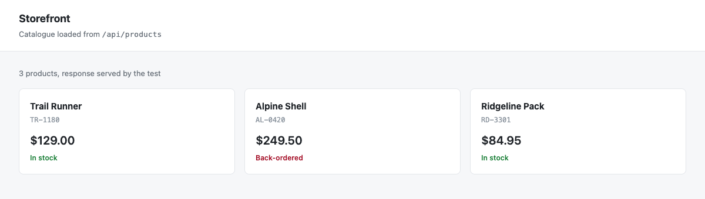

# Network Interception

Motus exposes a routing API that lets you intercept, inspect, modify, block, or mock any network request made by the browser. Interception is configured through route handlers registered on either a page or a browser context. All interception is asynchronous and non-destructive by default: if your handler does not call `FulfillAsync`, `ContinueAsync`, or `AbortAsync`, Motus lets the request proceed as it stands.

## Route Registration

### Page-scoped routes

Use `IPage.RouteAsync` to intercept requests made by a single page. The URL pattern is matched against the full request URL.

```csharp
await page.RouteAsync("**/api/products", async route =>
{
    // handle the intercepted request
    await route.ContinueAsync();
});
```

### Context-scoped routes

Use `IBrowserContext.RouteAsync` to intercept requests across every page in a browser context. This is useful for applying blanket policies such as blocking analytics or injecting authentication headers.

A context rule covers the pages that are already open as well as the ones opened later. On a page that is already open it applies from the next request onward, so a page that has finished loading has to request again, through a reload or through whatever it calls next, before the rule is seen.

```csharp
await context.RouteAsync("**/analytics/**", async route =>
{
    await route.AbortAsync();
});
```

Both overloads share the same signature:

```csharp
Task RouteAsync(string urlPattern, Func<IRoute, Task> handler);
```

### URL pattern syntax

A pattern is matched against the full request URL, query string and fragment included, and matching is case-sensitive. There are three forms, tried in this order:

- A pattern equal to the URL matches that URL and nothing else.
- A pattern containing `*` is a glob, and the glob has to cover the whole URL. Each `*` stands for any run of characters, path separators included, which makes `*` and `**` equivalent. Nothing else in the pattern is glob syntax: a brace list such as `{png,jpg}`, a `?`, and a character class are all matched as the literal characters they are.
- A pattern with no `*` matches any URL that contains it.

| Pattern | Matches |
|---|---|
| `**/api/**` | Any URL containing `/api/` |
| `https://example.com/**` | Any URL under `https://example.com/` |
| `**/*.json` | Any URL ending in `.json` |
| `**/search?*` | Any URL whose path ends with `/search` followed by a query string |
| `/api/` | Any URL containing `/api/`, as a substring |

Because a glob has to cover the whole URL, `**/api/products` does not match `https://example.com/api/products?page=2`. End the pattern with `**` when the request may carry a query string.

One handler takes a request, rather than each matching handler in turn. Page handlers are consulted before context handlers, and within each the most recently registered matching handler is the one that runs, so registering a second handler for a pattern shadows the first rather than queuing behind it. If the handler that runs returns without calling `FulfillAsync`, `ContinueAsync`, or `AbortAsync`, the request continues as it stands and no other handler is offered it.

## Fulfilling Requests

Call `IRoute.FulfillAsync` to respond to the request without ever reaching the network. Provide a `RouteFulfillOptions` record to specify the response.

```csharp
Task FulfillAsync(RouteFulfillOptions? options = null);
```

### RouteFulfillOptions

| Property | Type | Description |
|---|---|---|
| `Status` | `int?` | HTTP status code. Defaults to 200. |
| `Headers` | `IDictionary<string, string>?` | Response headers. |
| `Body` | `string?` | Response body as a string. |
| `BodyBytes` | `byte[]?` | Response body as raw bytes. |
| `ContentType` | `string?` | Sets the `Content-Type` response header. |
| `Path` | `string?` | Path to a file whose contents are served as the body. |

`ContentType` is a convenience shorthand. If both `ContentType` and a `Content-Type` entry in `Headers` are specified, `ContentType` takes precedence.

```csharp
await page.RouteAsync("**/api/user/me", async route =>
{
    await route.FulfillAsync(new RouteFulfillOptions
    {
        Status = 200,
        ContentType = "application/json",
        Body = """{"id": 42, "name": "Alice"}"""
    });
});
```

The page cannot tell the difference, so it renders the mocked body exactly as it would a real response.



To serve a file from disk:

```csharp
await page.RouteAsync("**/api/catalogue", async route =>
{
    await route.FulfillAsync(new RouteFulfillOptions
    {
        ContentType = "application/json",
        Path = "fixtures/catalogue.json"
    });
});
```

## Modifying Requests

Call `IRoute.ContinueAsync` to forward the request to the network with optional overrides. Omitting a property leaves that aspect of the original request unchanged.

```csharp
Task ContinueAsync(RouteContinueOptions? options = null);
```

### RouteContinueOptions

`RouteContinueOptions` is a positional record with all-optional parameters:

```csharp
public sealed record RouteContinueOptions(
    string? Url = null,
    string? Method = null,
    IDictionary<string, string>? Headers = null,
    string? PostData = null);
```

| Parameter | Description |
|---|---|
| `Url` | Redirect the request to a different URL. |
| `Method` | Override the HTTP method. |
| `Headers` | Replace the request headers entirely. |
| `PostData` | Replace the request body. |

```csharp
await page.RouteAsync("**/api/**", async route =>
{
    await route.ContinueAsync(new RouteContinueOptions(
        Headers: new Dictionary<string, string>
        {
            ["Authorization"] = "Bearer test-token",
            ["X-Request-Source"] = "motus-test"
        }
    ));
});
```

## Aborting Requests

Call `IRoute.AbortAsync` to cancel the request. The browser receives an error as if the network failed.

```csharp
Task AbortAsync(string? errorCode = null);
```

The optional `errorCode` parameter maps to a browser network error. Common values include:

| Error code | Meaning |
|---|---|
| `"aborted"` | The request was aborted (default when no code is supplied). |
| `"accessdenied"` | Permission was denied. |
| `"connectionrefused"` | The connection was refused. |
| `"connectionreset"` | The connection was reset. |
| `"internetdisconnected"` | No internet connection. |
| `"namenotresolved"` | DNS resolution failed. |
| `"timedout"` | The request timed out. |
| `"failed"` | A generic failure. |

```csharp
await page.RouteAsync("**.png**", async route =>
{
    await route.AbortAsync();
});
```

## Unrouting

Remove a previously registered route handler with `UnrouteAsync`. Pass the same URL pattern used during registration. If `handler` is omitted, all handlers for that pattern are removed.

```csharp
// IPage
Task UnrouteAsync(string urlPattern, Func<IRoute, Task>? handler = null);

// IBrowserContext
Task UnrouteAsync(string urlPattern, Func<IRoute, Task>? handler = null);
```

```csharp
Func<IRoute, Task> mockHandler = async route =>
{
    await route.FulfillAsync(new RouteFulfillOptions { Body = "[]", ContentType = "application/json" });
};

await page.RouteAsync("**/api/items", mockHandler);

// ... run the scenario that needs the mock ...

// Remove only the specific handler
await page.UnrouteAsync("**/api/items", mockHandler);

// Or remove all handlers for the pattern
await page.UnrouteAsync("**/api/items");
```

## IRequest

The `IRoute.Request` property exposes an `IRequest` describing the intercepted request.

| Member | Type | Description |
|---|---|---|
| `Url` | `string` | The full request URL. |
| `Method` | `string` | The HTTP method, e.g. `"GET"` or `"POST"`. |
| `Headers` | `IHeaderCollection` | The request headers. |
| `PostData` | `string?` | The request body, or `null` for requests without a body. |
| `ResourceType` | `string` | The resource type: `"document"`, `"script"`, `"image"`, `"fetch"`, etc. |
| `IsNavigationRequest` | `bool` | Whether the request is a top-level navigation. |
| `Frame` | `IFrame` | The frame that initiated the request. |
| `Response` | `IResponse?` | The corresponding response once the request completes, or `null`. |

```csharp
await page.RouteAsync("**", async route =>
{
    IRequest request = route.Request;

    if (request.ResourceType == "image")
    {
        await route.AbortAsync();
        return;
    }

    Console.WriteLine($"{request.Method} {request.Url}");
    await route.ContinueAsync();
});
```

## IResponse

`IResponse` is returned by navigation methods and by `WaitForResponseAsync`. It is also reachable from `IRequest.Response` after a request completes.

| Member | Type | Description |
|---|---|---|
| `Url` | `string` | The URL of the response (may differ from the request URL after redirects). |
| `Status` | `int` | The HTTP status code. |
| `StatusText` | `string` | The HTTP status text, e.g. `"OK"` or `"Not Found"`. |
| `Ok` | `bool` | `true` when `Status` is in the 200-299 range. |
| `Headers` | `IHeaderCollection` | The response headers. |
| `Request` | `IRequest` | The request that produced this response. |
| `Frame` | `IFrame` | The frame that initiated the request. |

### Reading the response body

```csharp
Task<byte[]> BodyAsync(CancellationToken ct = default);
Task<string> TextAsync(CancellationToken ct = default);
Task<T>      JsonAsync<T>(CancellationToken ct = default);
```

```csharp
IResponse response = await page.WaitForResponseAsync("**/api/products");

if (response.Ok)
{
    var products = await response.JsonAsync<List<Product>>();
}
```

## IHeaderCollection

`IHeaderCollection` provides case-insensitive access to HTTP headers. It implements `IEnumerable<KeyValuePair<string, IReadOnlyList<string>>>` so it can be iterated directly.

| Member | Description |
|---|---|
| `this[string name]` | Returns the first (or only) value for the header. Throws if absent. |
| `GetAll(string name)` | Returns all values for the header as a list. |
| `Contains(string name)` | Returns `true` if the header is present. |

Header name lookups are case-insensitive: `"Content-Type"`, `"content-type"`, and `"CONTENT-TYPE"` all resolve to the same header.

```csharp
IHeaderCollection headers = response.Headers;

if (headers.Contains("content-type"))
{
    string contentType = headers["content-type"];
}

// Headers that appear multiple times (e.g. Set-Cookie)
IReadOnlyList<string> cookies = headers.GetAll("set-cookie");
```

## Waiting for Network Events

### WaitForRequestAsync

Resolves when a request whose URL matches `urlPattern` is dispatched. The pattern uses the same glob syntax as route registration.

```csharp
Task<IRequest> WaitForRequestAsync(string urlPattern, double? timeout = null);
```

### WaitForResponseAsync

Resolves when a response whose URL matches `urlPattern` is received.

```csharp
Task<IResponse> WaitForResponseAsync(string urlPattern, double? timeout = null);
```

Both methods accept an optional `timeout` in milliseconds. The default timeout is inherited from the browser context configuration. A `TimeoutException` is thrown if the event does not occur within the timeout window.

Combine these with an action that triggers the request to avoid race conditions:

```csharp
// Start waiting before the action that triggers the request
Task<IResponse> responseTask = page.WaitForResponseAsync("**/api/checkout");

await page.GetByRole("button", "Place order").ClickAsync();

IResponse response = await responseTask;
Console.WriteLine($"Checkout responded with {response.Status}");
```

## Practical Examples

### Mock an API response

Replace a real API endpoint with fixture data during a test so the test does not depend on an external service.

```csharp
await page.RouteAsync("**/api/products", async route =>
{
    await route.FulfillAsync(new RouteFulfillOptions
    {
        Status = 200,
        ContentType = "application/json",
        Body = """
               [
                 {"id": 1, "name": "Widget A", "price": 9.99},
                 {"id": 2, "name": "Widget B", "price": 14.99}
               ]
               """
    });
});

await page.GotoAsync("https://shop.example.com/products");
await page.GetByText("Widget A").WaitForAsync();
```

### Block images

Prevent image requests from being sent. This can speed up tests that do not require visual content.

```csharp
// A brace list is not expanded, so an extension list is one rule per extension.
foreach (var extension in new[] { "png", "jpg", "jpeg", "gif", "webp", "svg", "ico" })
{
    await context.RouteAsync($"**.{extension}**", route => route.AbortAsync());
}
```

### Modify request headers

Inject an authentication token into every API call without modifying the application code.

```csharp
await context.RouteAsync("**/api/**", async route =>
{
    var existingHeaders = route.Request.Headers
        .ToDictionary(h => h.Key, h => h.Value[0]);

    existingHeaders["Authorization"] = $"Bearer {TestTokens.ValidAdminToken}";

    await route.ContinueAsync(new RouteContinueOptions(
        Headers: existingHeaders
    ));
});
```

## See Also

- [Configuration](configuration.md)
- [Testing Frameworks](testing-frameworks.md)
- `IPage` API reference
- `IBrowserContext` API reference
